<h1 align="center">
Proxmox VE: Passthrough with Intel Integrated Graphics Card Alder Lake Architecture  | vGPU, VT-d, SR-IOV
</h1>

## Table of Contents :scroll:

1. [A few words from me](#A-few-words-from-me-speech_balloon)
2. [Introduction](#Introduction-memo)
3. [Prerequisites](#Prerequisites-white_check_mark)
4. [My System Specification](#My-System-Specification-gear)
5. [Configuration](#Configuration-hammer_and_wrench)
    - [Step 1: Initial BIOS Configuration](#Step-1-Initial-BIOS-Configuration)
    - [Step 2: System Update and Required Package Installation](#Step-2-System-Update-and-Required-Package-Installation)
    - [Step 3: Proxmox Kernel Headers Installation and Configuration](#Step-3-Proxmox-Kernel-Headers-Installation-and-Configuration)
    - [Step 4: Installation and Configuration of i915-sriov-dkms](#Step-4-Installation-and-Configuration-of-i915-sriov-dkms)
    - [Step 5: IOMMU Configuration](#Step-5-IOMMU-Configuration)
    - [Step 6: SR-IOV Configuration](#Step-6-SR-IOV-Configuration)
6. [Summary](#Summary-books)
7. [My known Firmware Issues](#My-known-Firmware-Issues-warning)
8. [Bonus](#Bonus-gift)
9. [Windows 11 Installation](#Windows-11-Installation)
10. [Parrot OS Install](#Parrot-OS-Install)
    - [Step 1: Configuration](#Step-1-Configuration)
    - [Step 2: Instalation](#Step-2-Instalation)
    - [Step 3: Post-Installation System Configuration](#Step-3-Post-Installation-System-Configuration)
    - [Step 4: Configure the Virtual Machine in Proxmox](#Step-4-Configure-the-Virtual-Machine-in-Proxmox)
    - [Step 5: Connect via SSH and Check the Graphics Card](#Step-5-Connect-via-SSH-and-Check-the-Graphics-Card)
    - [Step 6: Install and Configure Graphics Card Drivers](#Step-6-Install-and-Configure-Graphics-Card-Drivers)
    - [Step 7: Install Firmware (if required)](#Step-7-Install-Firmware-if-required)
    - [Step 8: Verify the Graphics Card Operation](#Step-8-Verify-the-Graphics-Card-Operation)
11. [Ubuntu OS](#Ubuntu-OS)
12. [License](#MIT-License)


## ***A few words from me*** :speech_balloon:

	
I have been looking for a long time for a solution that will help me successfully configure iGPU forwarding on my new hardware. This prompted me to write my first guide. Some of you may find this helpful. I followed the guide [Derek Seaman's Tech Blog](https://www.derekseaman.com/2023/11/proxmox-ve-8-1-windows-11-vgpu-vt-d-passthrough-with-intel-alder-lake.html).
<br/>
Before I managed to solve the problem with transferring graphics to Windows, it took me two weeks of all my free time.
If you appreciate it, give me a follow.
<br/>

:exclamation: I'm still working on transferring the graphics card to Linux, such as Debian and Ubuntu. :exclamation:
<br/>
:fire: In Parrot OS works for me. :fire:

<br/>

## ***Introduction*** :memo:

In this step-by-step guide, we will walk through configuring graphics sharing for Intel integrated graphics on Alder Lake architecture in Proxmox. The guide covers hardware configuration, BIOS settings adjustment, and Proxmox configuration to enable the use of Intel integrated graphics in virtual machines.

<br/>

## ***Prerequisites*** :white_check_mark:

- Server with Intel Alder Lake processor
- Installed Proxmox VE
- Basic command-line proficiency and Linux system configuration knowledge

<br/>

## ***My System Specification*** :gear:

```
Processor: Intel N305
RAM: 32GB
Graphics Card: Intel UHD Graphics
Host Operating System: Proxmox VE 8.2.2
Kernel Version: Linux pve 6.5.13-3-pve #1 SMP PREEMPT_DYNAMIC PMX 6.5.13-3 (2024-03-20T10:45Z) x86_64 GNU/Linux
```

<br/>

## ***Configuration*** :hammer_and_wrench:

### *Step 1: Initial BIOS Configuration*

1. Access your server's BIOS/UEFI by pressing the appropriate key during boot (usually Delete, F2, or F10).
2. Enable VT-d (Intel Virtualization Technology for Directed I/O). This option is typically found in the processor's advanced settings section.
3. Ensure Multi-Monitor Support is enabled to make the integrated graphics card available to the system.
4. Save changes and exit BIOS/UEFI, then reboot the server.

<br/>

### *Step 2: System Update and Required Package Installation*

```sh
apt update && apt upgrade -y
uname -r
```

<br/>

### *Step 3: Proxmox Kernel Headers Installation and Configuration*

```sh
apt install proxmox-headers-6.5.13-3-pve proxmox-kernel-6.5.13-3-pve-signed
proxmox-boot-tool kernel pin 6.5.13-3-pve
proxmox-boot-tool refresh
reboot
```

After reboot, verify that Proxmox is using kernel `6.5.13-3`.

<br/>

### *Step 4: Installation and Configuration of i915-sriov-dkms*

Install additional packages:

```sh
apt update && apt install git sysfsutils pve-headers dkms mokutil -y
```

Remove old versions of i915-sriov-dkms:

```sh
rm -rf /var/lib/dkms/i915-sriov-dkms*
rm -rf /usr/src/i915-sriov-dkms*
rm -rf ~/i915-sriov-dkms
```

Clone the i915-sriov-dkms repository:

```sh
cd ~
git clone https://github.com/strongtz/i915-sriov-dkms.git
cd ~/i915-sriov-dkms
```

Configure dkms.conf:

```sh
cp -a dkms.conf{,.bak}
KERNEL=$(uname -r); KERNEL=${KERNEL%-pve}
sed -i 's/"@_PKGBASE@"/"i915-sriov-dkms"/g' dkms.conf
sed -i 's/"@PKGVER@"/"'"$KERNEL"'"/g' dkms.conf
sed -i 's/ -j$(nproc)//g' dkms.conf
cat dkms.conf
```

Add and install DKMS module:

```sh
apt install --reinstall dkms -y
dkms add .
cd /usr/src/i915-sriov-dkms-$KERNEL
dkms status
dkms install -m i915-sriov-dkms -v $KERNEL -k $(uname -r) --force -j 1
dkms status
```

Import MOK:
```sh
mokutil --import /var/lib/dkms/mok.pub
```

<br/>

### Step 5: IOMMU Configuration

Add or modify the line in `/etc/default/grub`:

```sh
GRUB_CMDLINE_LINUX_DEFAULT="quiet intel_iommu=on iommu=pt i915.enable_guc=3 i915.max_vfs=7"
```

Update GRUB configuration:

```sh
update-grub
reboot
```

### *Step 6: SR-IOV Configuration*
Add SR-IOV configuration to sysfs.conf:

```sh
echo "devices/pci0000:00/0000:00:02.0/sriov_numvfs = 7" > /etc/sysfs.conf
cat /etc/sysfs.conf
reboot
```

:exclamation: If using Proxmox 8.1 or later with secure boot you MUST setup MOK. As the Proxmox host reboots, monitor the boot process and wait for the Perform MOK management window. If you miss the first reboot you will need to re-run the mokutil command and reboot again. The DKMS module will NOT load until you step through this setup. 
<br/>
Select `Enroll MOK > Continue > Yes > 'your_password_MOK_' > Reboot`.

Check GPU availability:

```sh
lspci | grep VGA
dmesg | grep i915
```

<br/>

## Summary :books:
After completing these steps, your Intel integrated graphics card should be available for virtual machines on Proxmox. Note that specific BIOS settings may vary depending on the motherboard manufacturer, so refer to the hardware documentation as needed.

<br/>

## *My known Firmware Issues* :warning:
#### :wrench: If we have a problem with the firmware `Failed to load DMC firmware i915/adlp_dmc.bin. Disabling runtime power management`

```sh
mv /lib/firmware/i915/adlp_dmc.bin ./adlp_dmc.bin-backup
wget -r -nd -e robots=no -A '*.bin' --accept-regex '/plain/' https://git.kernel.org/pub/scm/linux/kernel/git/firmware/linux-firmware.git/tree/i915/adlp_dmc.bin
mv adlp_dmc.bin /lib/firmware/i915/
ls /lib/firmware/i915/

update-initramfs -u
proxmox-boot-tool refresh
reboot
```

After this steps check again
```sh
cat /sys/kernel/debug/dri/0/i915_dmc_info
dmesg | grep i915
```
<br/>

#### :wrench: Problems with bad version `[drm] *ERROR* GT0: IOV: Unable to confirm version` `[drm] *ERROR* GT0: IOV: Found interface version` [Issues link](https://github.com/strongtz/i915-sriov-dkms/issues/150)
Edit this file `~/i915-sriov-dkms/drivers/gpu/drm/i915/gt/uc/abi/guc_version_abi.h`
<br/>
<br/>
```sh
#define GUC_VF_VERSION_LATEST_MINOR     0
```

to

```sh
#define GUC_VF_VERSION_LATEST_MINOR     9
```

<br/>

## *Bonus* :gift:
Try to use when you have problems.
In /etc/modprobe.d/:

```sh
cat kvm.conf
options kvm ignore_msrs=1
```

```sh
cat intel-microcode-blacklist.conf
# The microcode module attempts to apply a microcode update when
# it autoloads.  This is not always safe, so we block it by default.
blacklist microcode
```

```sh
cat i915.conf
options i915 enable_guc=3
```
---
<br/><br/>

<h1 align="center">
Windows 11 Installation
</h1>

1. Download the tested for me Fedora **Windows VirtIO driver ISO** from tested me [here](https://fedorapeople.org/groups/virt/virtio-win/direct-downloads/stable-virtio/virtio-win.iso) or check new version on this [site](https://pve.proxmox.com/wiki/Windows_VirtIO_Drivers).
2. Download the **Windows 11 ISO**. I use my custom-prepared Windows specifically designed for x64 devices.
3. Upload both the VirtIO and Windows 11 ISOs to the Proxmox server.
<p style="display: flex; flex-wrap: wrap; justify-content: center;">
<br/>
<a href="manual/images/windows11/uploud_image_in_proxmox.png">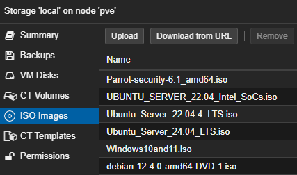</a>
</p>

4. Start the VM creation process. On the **General** tab enter the name of your VM. Click **Next**.
5. On the **OS** tab select the Windows 11 ISO.  Change the Guest OS to **Microsoft Windows, 11/2022/2025.** Tick the box for the **Add additional drive for VirtIO drivers**, then select your **Windows VirtIO ISO**. Click **Next**. Note: The VirtIO drivers option is new to Proxmox 8.1. I added a Proxmox 8.0 step at the end to manually add a new CD drive and mount the VirtIO ISO.
<p style="display: flex; flex-wrap: wrap; justify-content: center;">
<br/>
<a href="manual/images/windows11/create_vm_windows11_os.png">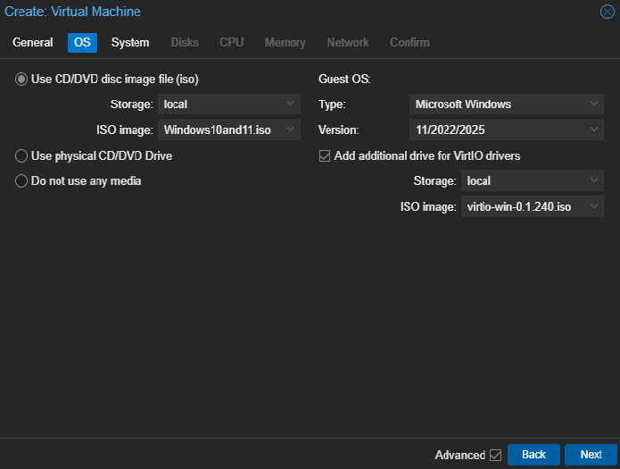</a>
</p>

6. On the System page modify the settings to match EXACTLY as those shown below. If your local VM storage is named differently (e.g. NOT local, use that instead)
<p style="display: flex; flex-wrap: wrap; justify-content: center;">
<br/>
<a href="manual/images/windows11/create_vm_windows11_system.png">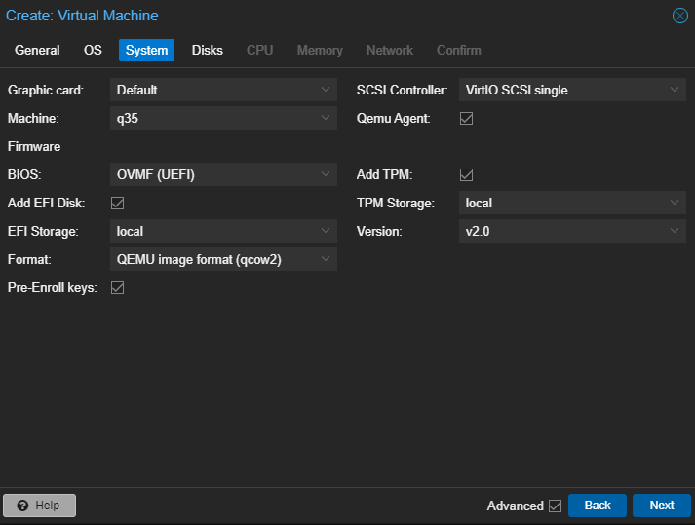</a>
</p>

7. On the Disks tab, modify the size as needed. I suggest a minimum of 55GB. Modify the Cache and Discard settings as shown. Only enable Discard if using SSD/NVMe storage (not a spinning disk).
<p style="display: flex; flex-wrap: wrap; justify-content: center;">
<br/>
<a href="manual/images/windows11/create_vm_windows11_disks.png">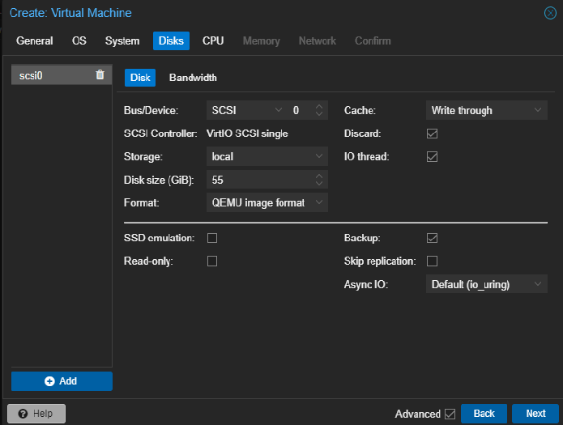</a>
</p>

8. On the CPU tab, change the Type to host. Allocate however many cores you want. I chose 4.
<p style="display: flex; flex-wrap: wrap; justify-content: center;">
<br/>
<a href="manual/images/windows11/create_vm_windows11_cpu.png">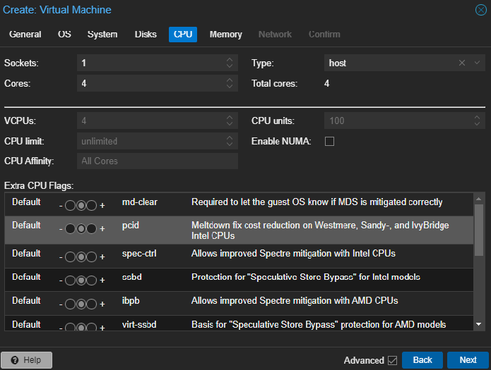</a>
</p>

9. On the Memory tab allocated as much memory as you want. I suggest 8GB or more.
10. On the Network tab change the model to VirtIO.
<p style="display: flex; flex-wrap: wrap; justify-content: center;">
<br/>
<a href="manual/images/windows11/create_vm_windows11_network.png">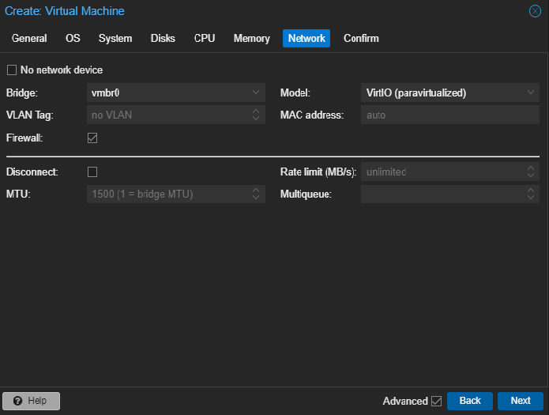</a>
</p>

11. Review your VM configuration. Click Finish.
12. In Proxmox click on the Windows 11 VM, then open a console. Start the VM, then press Enter to boot from the CD.
<p style="display: flex; flex-wrap: wrap; justify-content: center;">
<br/>
<a href="manual/images/windows11/create_vm_windows11_start_vm.png">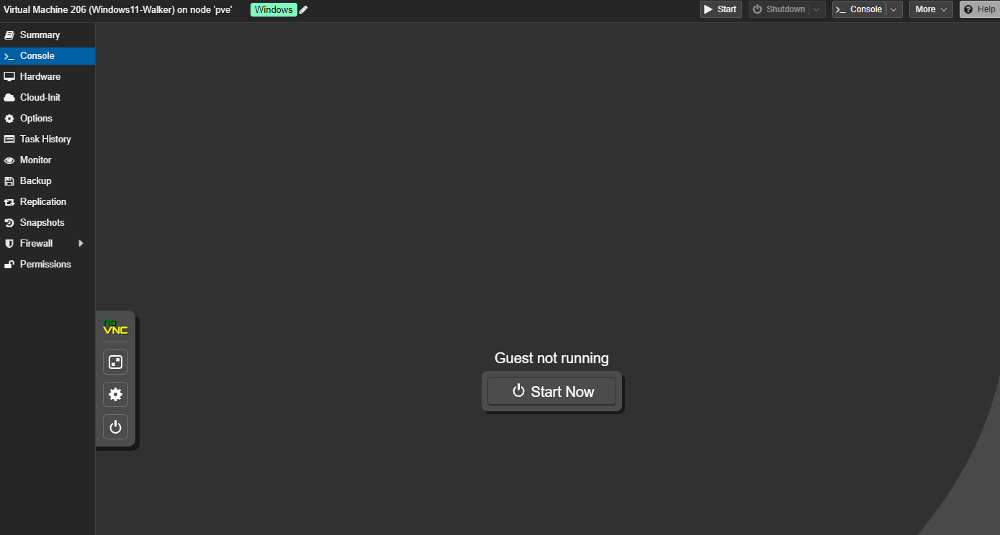</a>
</p>

13. Select your language, time, currency, and keyboard. Click Next. Click Install now.
14. Click I don’t have a product key. 
16. Select Windows 11 Pro. Click Next.
17. Tick the box to accept the license agreement. Click Next.
18. Click Load driver.
<p style="display: flex; flex-wrap: wrap; justify-content: center;">
    <a href="manual/images/windows11/create_vm_windows11_load_vm_drivers.png">
        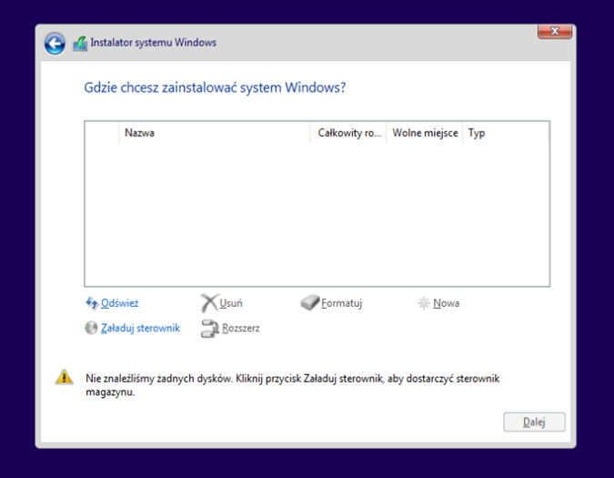
    </a>
    &nbsp;
    <a href="manual/images/windows11/create_vm_windows11_load_vm_drivers2.png">
        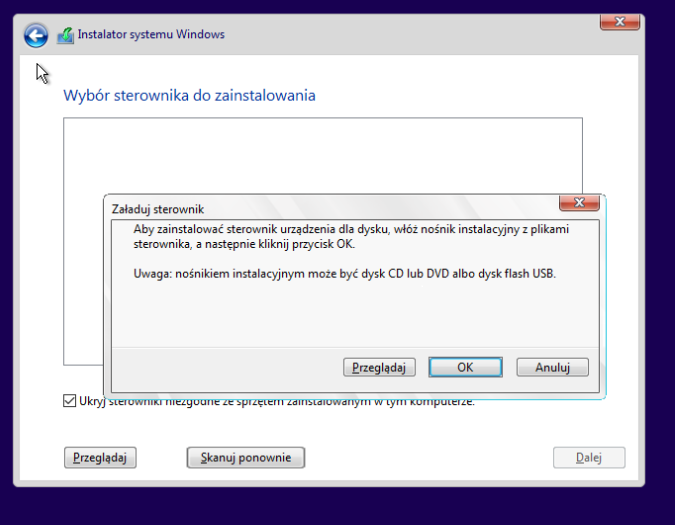
    </a>
</p>

19. Select the w11 driver. Click Next.
<p style="display: flex; flex-wrap: wrap; justify-content: center;">
    <a href="manual/images/windows11/create_vm_windows11_load_vm_drivers3.png">
        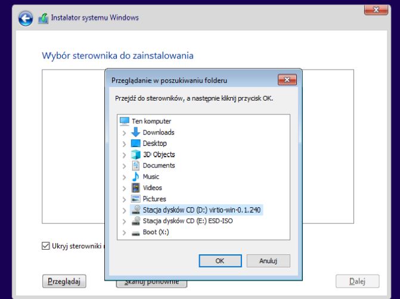
    </a>
    &nbsp;
    <a href="manual/images/windows11/create_vm_windows11_load_vm_drivers4.png">
        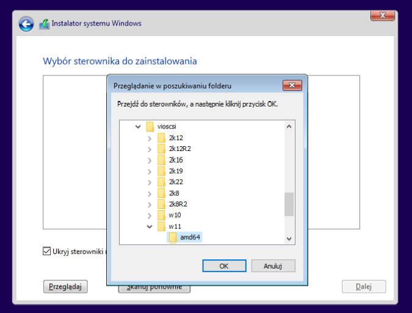
    </a>
    &nbsp;
    <a href="manual/images/windows11/create_vm_windows11_load_vm_drivers5.png">
        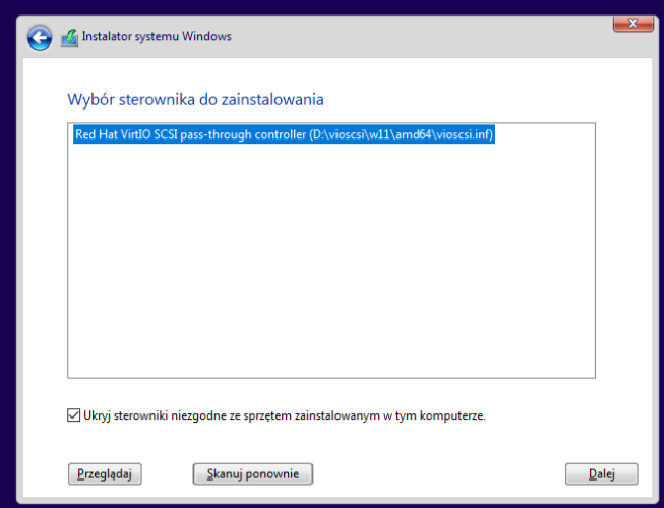
    </a>
</p>

20. On Where do you want to install Windows click Next.
<p style="display: flex; flex-wrap: wrap; justify-content: center;">
<br/>
<a href="manual/images/windows11/create_vm_windows11_install_windows.png">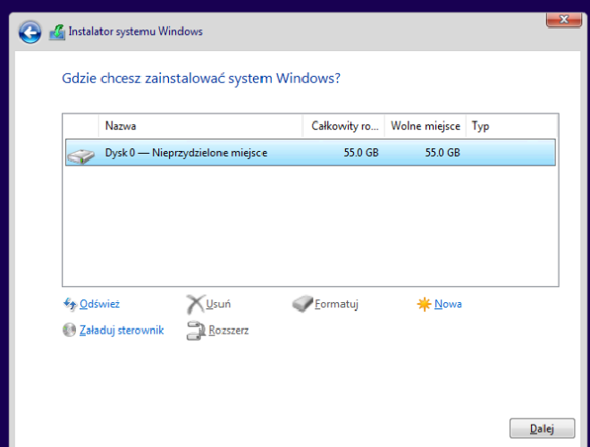</a>
</p>

23. Sit back and wait for Windows 11 to install.
<p style="display: flex; flex-wrap: wrap; justify-content: center;">
<br/>
<a href="manual/images/windows11/create_vm_windows11_install_windows2.png">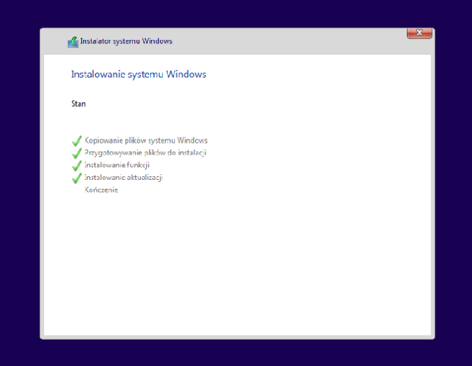</a>
</p>

24. Configure the system now. I always use a local account when setting up the system. If you want to set a password but don't want to provide a hint, leave the account without a password during the setup. After the first login, go to:

`Computer Management > Local Users and Groups > Users > Right-click on your user > Set Password...`

25. When we have set a password (I recommend setting a password because we will be using RDP) for our local account, we can enable Remote Desktop.

`Settings > System > Remote Desktop > Click ON`
<p style="display: flex; flex-wrap: wrap; justify-content: center;">
<br/>
<a href="manual/images/windows11/create_vm_windows11_configure_windows.png">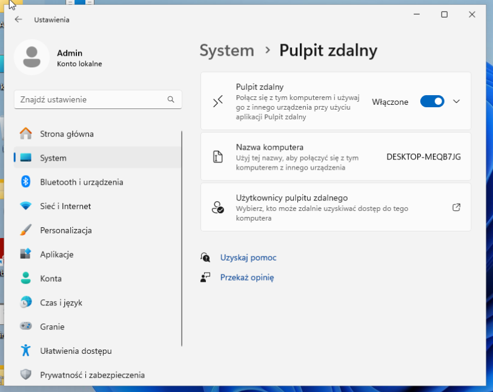</a>
</p>

26. In Windows open the mounted ISO in Explorer. Run virtio-win-gt-x64 and virtio-win-guest-tools. Use all default options.
<p style="display: flex; flex-wrap: wrap; justify-content: center;">
    <a href="manual/images/windows11/create_vm_windows11_configure_windows2.png">
        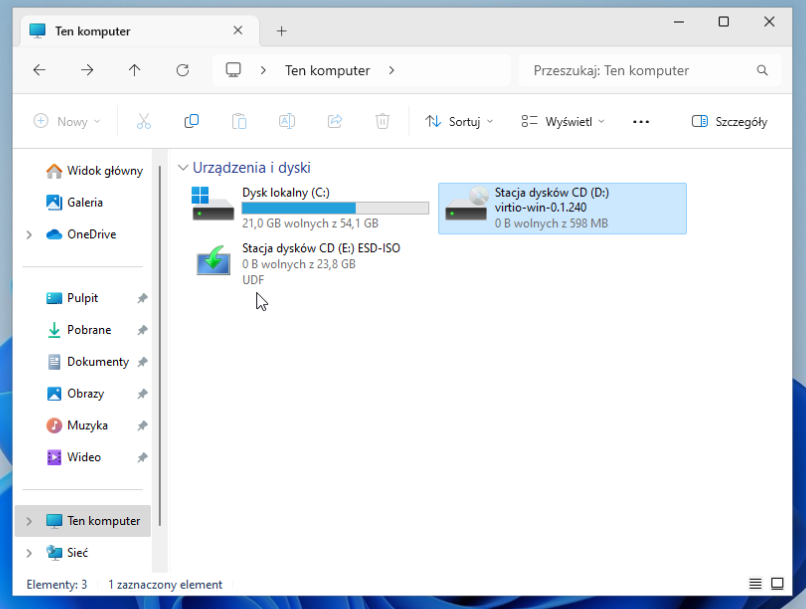
    </a>
    &nbsp;
    <a href="manual/images/windows11/create_vm_windows11_configure_windows3.png">
        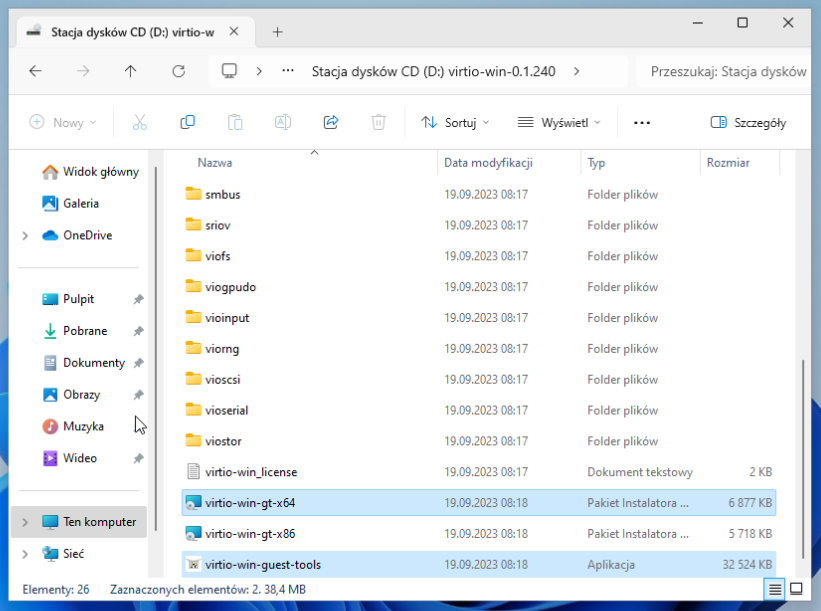
    </a>
</p>

27. Shutdown Windows.
28. In the Proxmox console click on the Windows 11 VM in the left pane. Then click on Hardware. Click on the Display item in the right pane. Click Edit, then change it to none.
<p style="display: flex; flex-wrap: wrap; justify-content: center;">
<br/>
<a href="manual/images/windows11/create_vm_windows11_configure_windows5.png">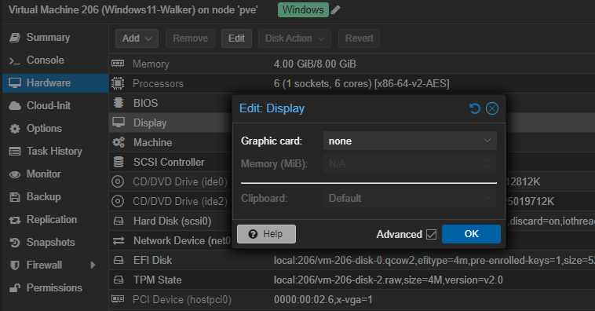</a>
</p>

29. In the top of the right pane click on Add, then select PCI Device.
30. Select Raw Device. Then review all of the PCI devices available. Select one of the sub-function (x.1, x.2, etc..) graphics controllers (i.e. ANY entry except the 00:02.0). Do NOT use the root “0” device, for ANYTHING. I chose 02.6. Click Add. Do NOT tick the “All Functions” box. Tick the box next to Primary GPU. Click Add.
<p style="display: flex; flex-wrap: wrap; justify-content: center;">
<br/>
<a href="manual/images/windows11/create_vm_windows11_configure_windows4.png">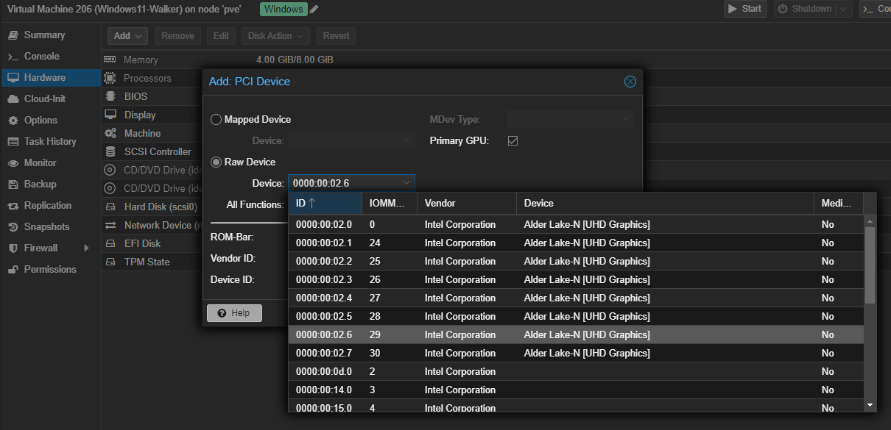</a>
</p>

31. Start the Windows 11 VM and wait a couple of minutes for it to boot and RDP to become active. Note, the Proxmox Windows console will NOT connect since we removed the virtual VGA device. You will see a Failed to connect to server message. You can now ONLY access Windows via RDP. U can chceck IP address in Summary.
<p style="display: flex; flex-wrap: wrap; justify-content: center;">
<br/>
<a href="manual/images/windows11/create_vm_windows11_check_ip_address.png">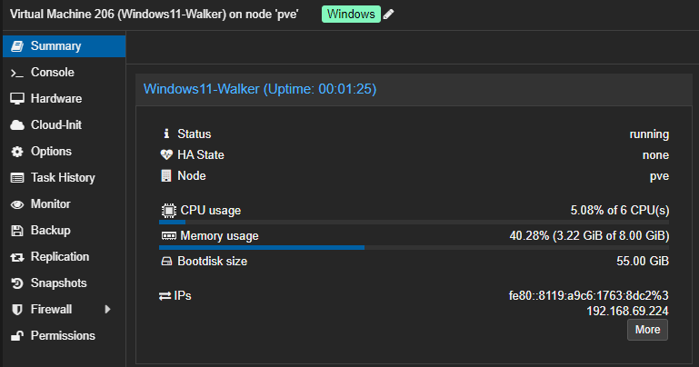</a>
</p>

32. When you connect to the remote desktop, install the graphics card driver. Due to the type of my graphics setup, I will use Snappy Driver. Of course, you can download it from the official websites if you want. To do this, download and extract the program on the virtual machine, and then run it.

---
Without drivers | Benchamark [site](https://webglsamples.org/aquarium/aquarium.html)
<p style="display: flex; flex-wrap: wrap; justify-content: center;">
<br/>
<a href="manual/images/windows11/create_vm_windows11_without_drivers.png">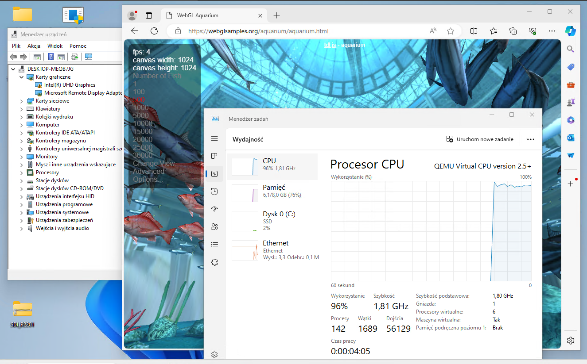</a>
</p>

33. Allow the firewall access during the startup, and then click "Download Indexes Only".
<p style="display: flex; flex-wrap: wrap; justify-content: center;">
    <a href="manual/images/windows11/create_vm_windows11_snappy_driver_installer.png">
        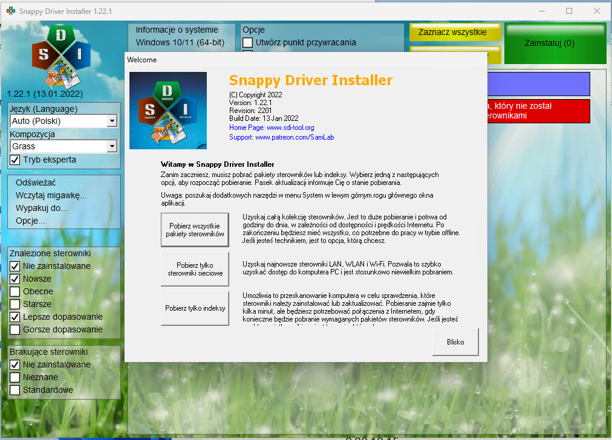
    </a>
</p>

34. Select your graphics card drivers and click **Install**
<p style="display: flex; flex-wrap: wrap; justify-content: center;">
<br/>
<a href="manual/images/windows11/create_vm_windows11_snappy_driver_installer2.png">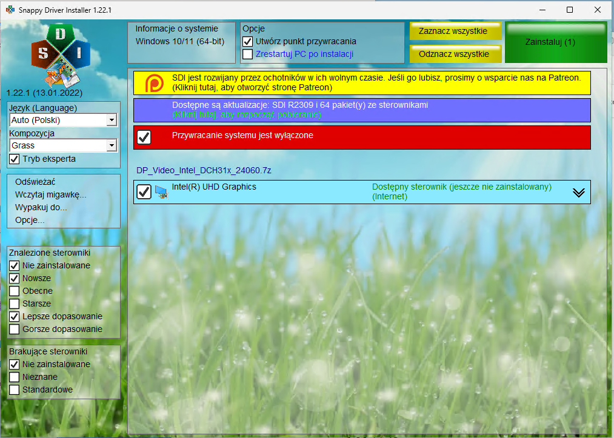</a>
</p>

35. After installation complete reboot Windows.
36. Connect again to RDP. Now you can check if the graphics card driver is working. Verify the device status in Device Manager > Display adapters.
37. If everything is fine, open Task Manager > Performance. You should see your graphics card listed.
38. Once that's done, open a web browser and enter the URL LINK. You should see that the graphics card is working and displaying more than a few FPS (this depends on how powerful your graphics card is).
<p style="display: flex; flex-wrap: wrap; justify-content: center;">
<br/>
<a href="manual/images/windows11/create_vm_windows11_with_drivers.png">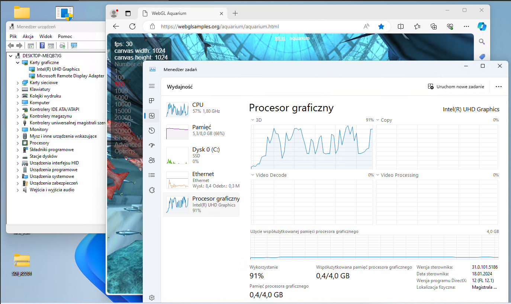</a>
</p>

39. Done :smile:

---
<br/><br/>

<h1 align="center">
Parrot OS Install
</h1>

### Step 1: Configuration

1. Download the [Parrot ISO](https://www.derekseaman.com/2023/11/.https://deb.parrot.sh/parrot/iso/6.1/Parrot-security-6.1_amd64.iso).
2. Upload Parrot ISO to the Proxmox server.
<p style="display: flex; flex-wrap: wrap; justify-content: center;">
<br/>
<a href="manual/images/parrot/uploud_image_in_proxmox"></a>
</p>

3. Start the VM creation process. On the General tab enter the name of your VM. Click Next.
4. On the OS tab select the Parrot ISO. Change the Guest OS to Linux, 6.x - 2.6 Kernel. Click Next.
<p style="display: flex; flex-wrap: wrap; justify-content: center;">
<br/>
<a href="manual/images/parrot/create_vm_parrot_os">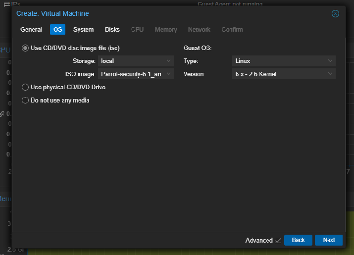</a>
</p>

5. On the System page modify the settings to match EXACTLY as those shown below. If your local VM storage is named differently (e.g. NOT local, use that instead)
<p style="display: flex; flex-wrap: wrap; justify-content: center;">
<br/>
<a href="manual/images/parrot/create_vm_parrot_system">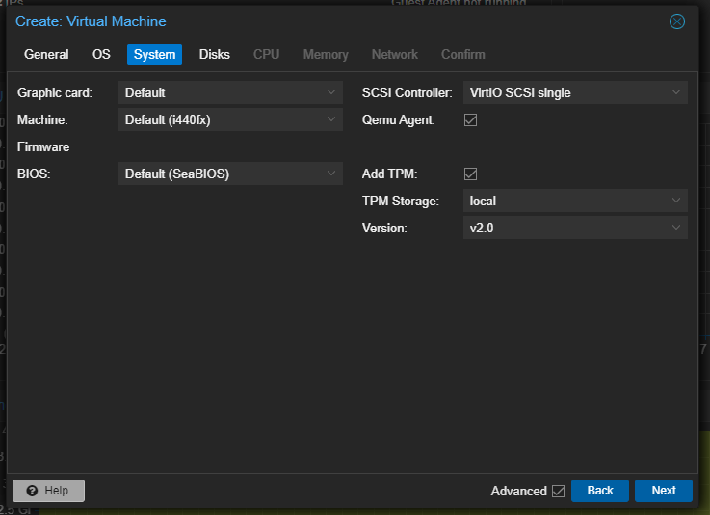</a>
</p>

6. On the Disks tab, modify the size as needed. I suggest a minimum of 36GB. Modify the Cache and Discard settings as shown. Only enable Discard if using SSD/NVMe storage (not a spinning disk).
<p style="display: flex; flex-wrap: wrap; justify-content: center;">
<br/>
<a href="manual/images/parrot/create_vm_parrot_disks">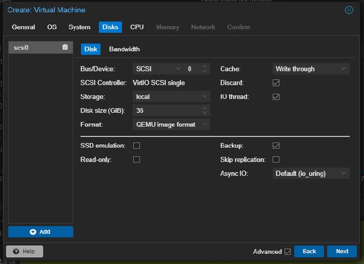</a>
</p>

7. On the CPU tab, change the Type to host. Allocate however many cores you want. I chose 4.
<p style="display: flex; flex-wrap: wrap; justify-content: center;">
<br/>
<a href="manual/images/parrot/create_vm_parrot_cpu">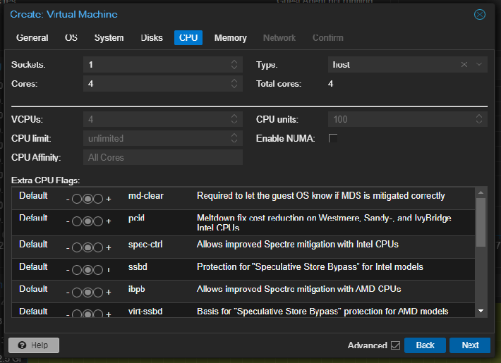</a>
</p>

8. On the Memory tab allocated as much memory as you want. I suggest 6GB or more.
9. On the Network tab change the model to VirtIO.
<p style="display: flex; flex-wrap: wrap; justify-content: center;">
<br/>
<a href="manual/images/parrot/create_vm_parrot_network">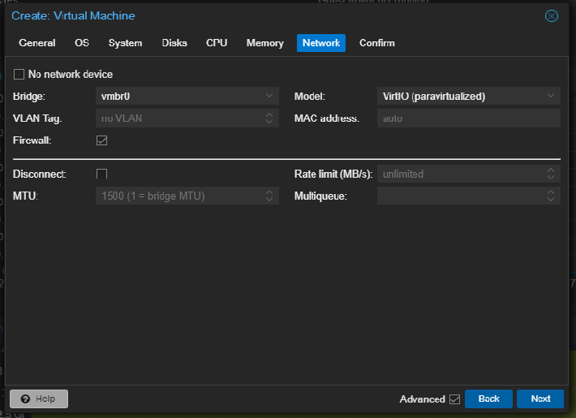</a>
</p>

10. Review your VM configuration. Click Finish.


### Step 2: Instalation

1. In Proxmox click on the Parrot VM, then open a console. Start the VM, then press Try / Install.
<p style="display: flex; flex-wrap: wrap; justify-content: center;">
    <a href="manual/images/parrot/create_vm_parrot_start_vm.png">
        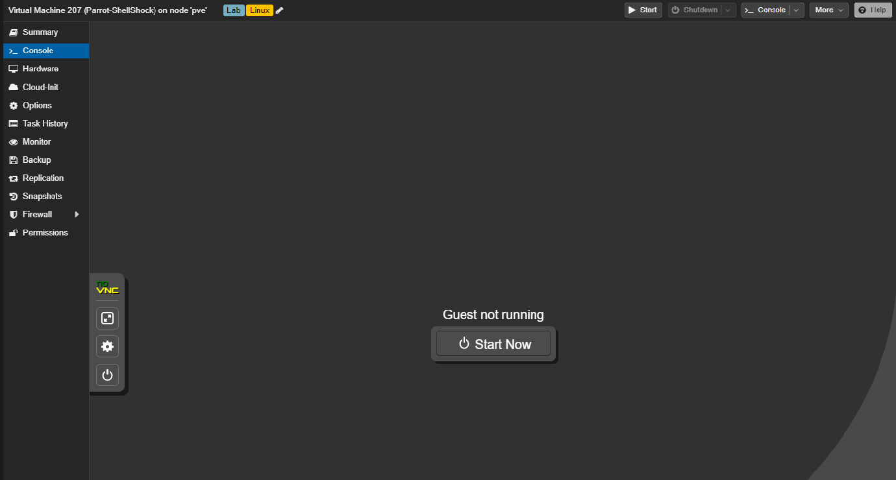
    </a>
    &nbsp;
    <a href="manual/images/parrot/create_vm_parrot_start_vm2.png">
        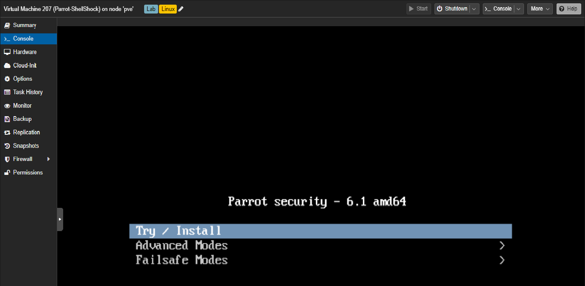
    </a>
</p>

2. Click the "Install Parrot" button when VM boot.
<p style="display: flex; flex-wrap: wrap; justify-content: center;">
<br/>
<a href="manual/images/parrot/create_vm_parrot_install">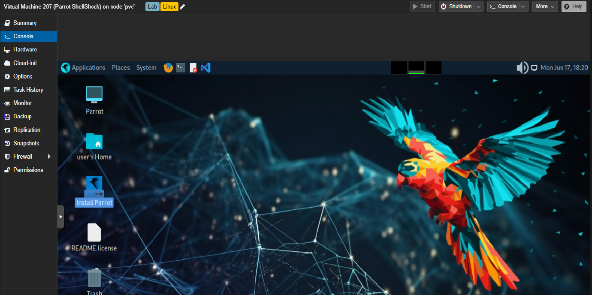</a>
</p>

3. Go through the installation wizard, following the on-screen instructions.
<p style="display: flex; flex-wrap: wrap; justify-content: center;">
    <a href="manual/images/parrot/create_vm_parrot_install2.png">
        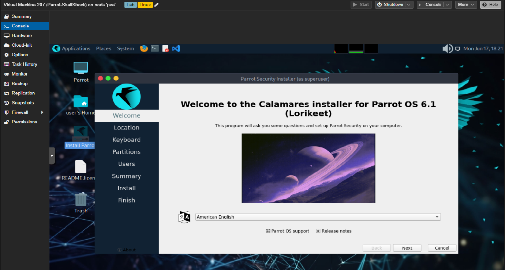
    </a>
    &nbsp;
    <a href="manual/images/parrot/create_vm_parrot_install3.png">
        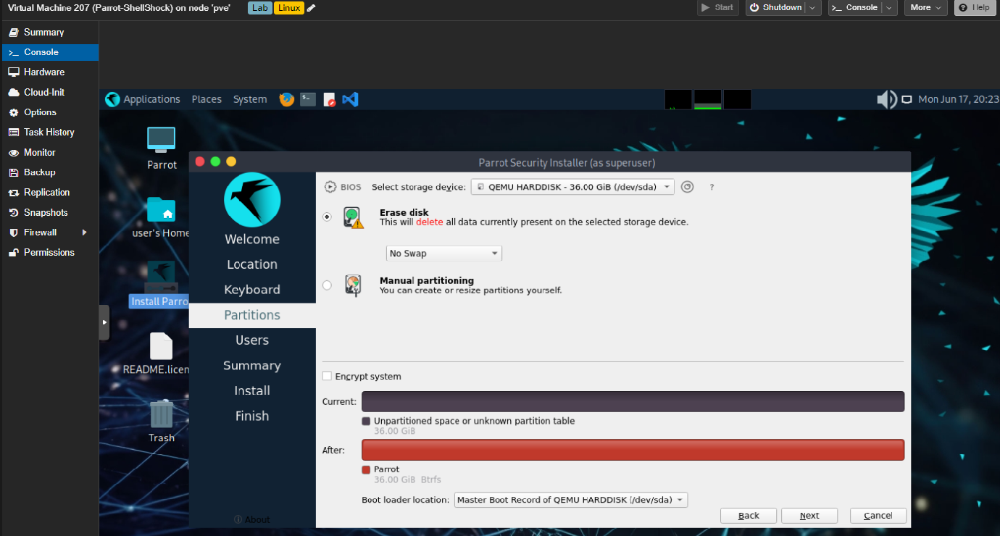
    </a>
</p>

4. Complete the installation and restart the computer.
<p style="display: flex; flex-wrap: wrap; justify-content: center;">
<br/>
<a href="manual/images/parrot/create_vm_parrot_install4">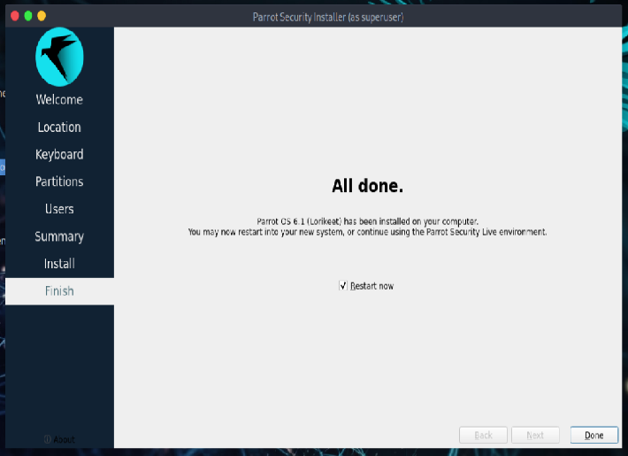</a>
</p>

5. When the system restarts, shut it down.


### Step 3: Post-Installation System Configuration

1. After the restart, open the terminal and execute the following commands:

```sh
sudo passwd  # Set a new root password
su  # Switch to the root account
apt update && apt install openssh-server -y  # Update package list and install SSH server
```

2. Edit the /etc/ssh/sshd_config file using your preferred text editor, e.g., nano:

```sh
# Add or change the line to:
PermitRootLogin yes
```

3. Start and reload the SSH service:

```sh
systemctl start ssh && systemctl enable ssh && systemctl reload ssh
```

4. Shutdown the computer.


### Step 4: Configure the Virtual Machine in Proxmox

1. In the Proxmox console click on the Parrot VM in the left pane. Then click on Hardware. Click on the Display item in the right pane. Click Edit, then change it to none.
<p style="display: flex; flex-wrap: wrap; justify-content: center;">
<br/>
<a href="manual/images/parrot/create_vm_parrot_configure_vm2">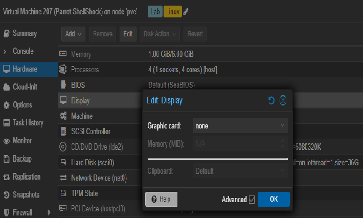</a>
</p>

2. In the top of the right pane click on Add, then select PCI Device.
3. Select Raw Device. Then review all of the PCI devices available. Select one of the sub-function (x.1, x.2, etc..) graphics controllers (i.e. ANY entry except the 00:02.0). Do NOT use the root “0” device, for ANYTHING. I chose 02.4. Click Add. Do NOT tick the “All Functions” box. Tick the box next to Primary GPU. Click Add.
<p style="display: flex; flex-wrap: wrap; justify-content: center;">
<br/>
<a href="manual/images/parrot/create_vm_parrot_configure_vm">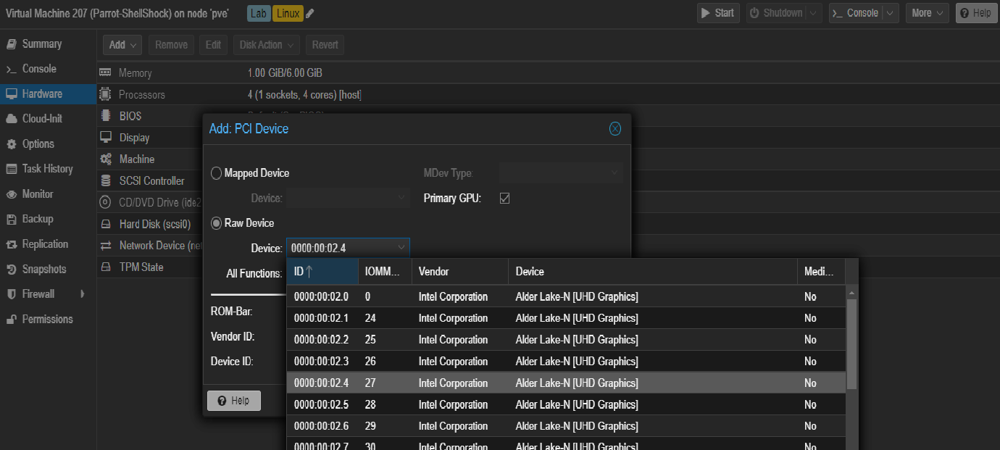</a>
</p>

4. Start the Parrot VM and wait a couple of minutes for it to boot and SSH to become active. Note, the Proxmox Windows console will NOT connect since we removed the virtual VGA device. You will see a Failed to connect to server message. You can now ONLY access Windows via SSH. U can chceck IP address in Summary.
<p style="display: flex; flex-wrap: wrap; justify-content: center;">
<br/>
<a href="manual/images/parrot/create_vm_parrot_check_ip">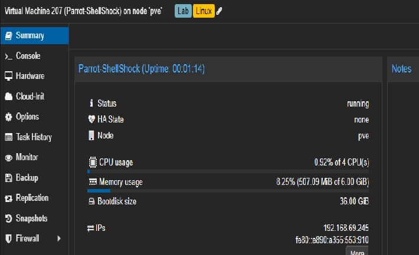</a>
</p>


### Step 5: Connect via SSH and Check the Graphics Card

1. Connect to the server via SSH and check which kernel version you are using. My version is 6.5.0-13parrot1-amd64 (from what I've learned online, the kernel version shouldn't differ much from the Proxmox kernel version. Unfortunately, I cannot confirm this dependency yet).

```sh
uname -r  # Display the kernel version
```

2. Check if the graphics card is recognized by the system:

```sh
lspci | grep VGA  # Display a list of VGA devices
```
<p style="display: flex; flex-wrap: wrap; justify-content: center;">
<br/>
<a href="manual/images/parrot/create_vm_parrot_configure_system">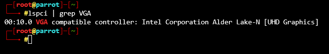</a>
</p>

### Step 6: Install and Configure Graphics Card Drivers

1. Clone the repository:

```sh
git clone https://github.com/strongtz/i915-sriov-dkms  # Clone the repository locally
```

2. Modify DKMS configuration to match your kernel version in the i915-sriov-dkms/dkms.conf file:

```sh
nano i915-sriov-dkms/dkms.conf
# Change values to:
PACKAGE_NAME="i915-sriov-dkms"
PACKAGE_VERSION="6.5"
```

3. Edit the `guc_version_abi.h` file:

```sh
nano i915-sriov-dkms/drivers/gpu/drm/i915/gt/uc/abi/guc_version_abi.h
## Change the line:
#define GUC_VF_VERSION_LATEST_MINOR 0
```
To:
```sh
#define GUC_VF_VERSION_LATEST_MINOR 9
```

4. Move the files and install DKMS:

```sh
cp -r i915-sriov-dkms/ /usr/src/i915-sriov-dkms-6.5  # Copy the repository to DKMS source directory
dkms install -m i915-sriov-dkms -v 6.5 --kernelsourcedir=/usr/src/linux-headers-6.5.0-13parrot1-amd64 --force  # Install DKMS drivers
```

<p style="display: flex; flex-wrap: wrap; justify-content: center;">
<br/>
<a href="manual/images/parrot/create_vm_parrot_configure_system2"></a>
</p>


5. Modify GRUB configuration in `/etc/default/grub` file and update:

```sh
nano /etc/default/grub
# Change the line:
GRUB_CMDLINE_LINUX_DEFAULT="quiet splash"
# To:
GRUB_CMDLINE_LINUX_DEFAULT="quiet splash intel_iommu=on i915.enable_guc=3"

update-grub  # Update GRUB configuration
update-initramfs -u -k $(uname -r)  # Update initramfs
```

<p style="display: flex; flex-wrap: wrap; justify-content: center;">
<br/>
<a href="manual/images/parrot/create_vm_parrot_configure_system3">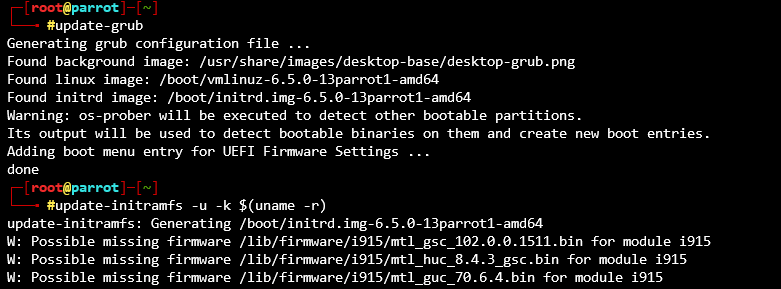</a>
</p>


### Step 7: Install Firmware (if required)

1. If errors appear like in the screenshot below with missing firmware, you need to search for it on the Internet. I couldn't find the exact versions, but I found similar ones. Here is what I did.
<p style="display: flex; flex-wrap: wrap; justify-content: center;">
<br/>
<a href="manual/images/parrot/create_vm_parrot_configure_system3"></a>
</p>

2. Download the missing firmware:


```sh
mkdir firmware
cd firmware/
wget https://git.kernel.org/pub/scm/linux/kernel/git/firmware/linux-firmware.git/plain/i915/mtl_guc_70.bin
wget https://git.kernel.org/pub/scm/linux/kernel/git/firmware/linux-firmware.git/plain/i915/mtl_huc_gsc.bin
wget https://git.kernel.org/pub/scm/linux/kernel/git/firmware/linux-firmware.git/plain/i915/mtl_gsc_1.bin

# Rename the files to match the missing ones
mv mtl_guc_70.bin mtl_guc_70.6.4.bin
mv mtl_gsc_1.bin mtl_gsc_102.0.0.1511.bin
mv mtl_huc_gsc.bin mtl_huc_8.4.3_gsc.bin

# Move the files to the appropriate directory
mv *.bin /lib/firmware/i915/

# Additionally, download adlp_dmc.bin
wget -r -nd -e robots=no -A '*.bin' --accept-regex '/plain/' https://git.kernel.org/pub/scm/linux/kernel/git/firmware/linux-firmware.git/tree/i915/adlp_dmc.bin
mv /lib/firmware/i915/adlp_dmc.bin ./adlp_dmc.bin-backup
mv adlp_dmc.bin /lib/firmware/i915/

# Update GRUB and initramfs
update-grub
update-initramfs -u -k $(uname -r)
reboot  # Restart the computer
```

### Step 8: Verify the Graphics Card Operation

1. Check the operation of the graphics card:
```sh
dmesg | grep i915  # Display system messages related to the graphics card
lspci | grep VGA  # Display a list of VGA devices
dkms status  # Check the status of installed DKMS modules
```

2. List the graphics card:

```sh
ls -al /dev/dri/  # Display graphic devices
```

3. Install additional software:

```sh
apt update && apt install intel-media-va-driver-non-free intel-gpu-tools vainfo -y  # Install graphic drivers and tools
```

4. Check the graphics card codecs:

```sh
vainfo  # Display video codec information
```

5. Done, the graphics card should work correctly. :smile:

---
<br/><br/>

<h1 align="center">
Ubuntu OS
</h1>

I managed to partially solve the kernel issue on Ubuntu by installing a fresh Ubuntu 23.10 Live Server, which defaults to kernel 6.5.0-41-generic. This kernel works with DKMS and VGPU passthrough on my setup. Then, I perform an upgrade to Ubuntu 24.04 LTS while keeping the old kernel. This way, I have the latest LTS version running with GPU passthrough on Proxmox. Below is the link to my script. Remember to back up before running it. I also used a fork of i915 from [michael-pptf](https://github.com/michael-pptf/i915-sriov-dkms).

[Link](https://github.com/kamilllooo/proxmox/blob/main/scripts/ubuntu_guest_proxmox_vgpu.sh) to the script or use this command:
```sh
bash -c "$(wget -qO - https://raw.githubusercontent.com/kamilllooo/proxmox/main/scripts/ubuntu_guest_proxmox_vgpu.sh | tr -d '\r')"
```

## MIT License

Copyright (c) 2024 Kamilllooo

Permission is hereby granted, free of charge, to any person obtaining a copy
of this software and associated documentation files (the "Software"), to deal
in the Software without restriction, including without limitation the rights
to use, copy, modify, merge, publish, distribute, sublicense, and/or sell
copies of the Software, and to permit persons to whom the Software is
furnished to do so, subject to the following conditions:

The above copyright notice and this permission notice shall be included in all
copies or substantial portions of the Software.

THE SOFTWARE IS PROVIDED "AS IS", WITHOUT WARRANTY OF ANY KIND, EXPRESS OR
IMPLIED, INCLUDING BUT NOT LIMITED TO THE WARRANTIES OF MERCHANTABILITY,
FITNESS FOR A PARTICULAR PURPOSE AND NONINFRINGEMENT. IN NO EVENT SHALL THE
AUTHORS OR COPYRIGHT HOLDERS BE LIABLE FOR ANY CLAIM, DAMAGES OR OTHER
LIABILITY, WHETHER IN AN ACTION OF CONTRACT, TORT OR OTHERWISE, ARISING FROM,
OUT OF OR IN CONNECTION WITH THE SOFTWARE OR THE USE OR OTHER DEALINGS IN THE
SOFTWARE.


